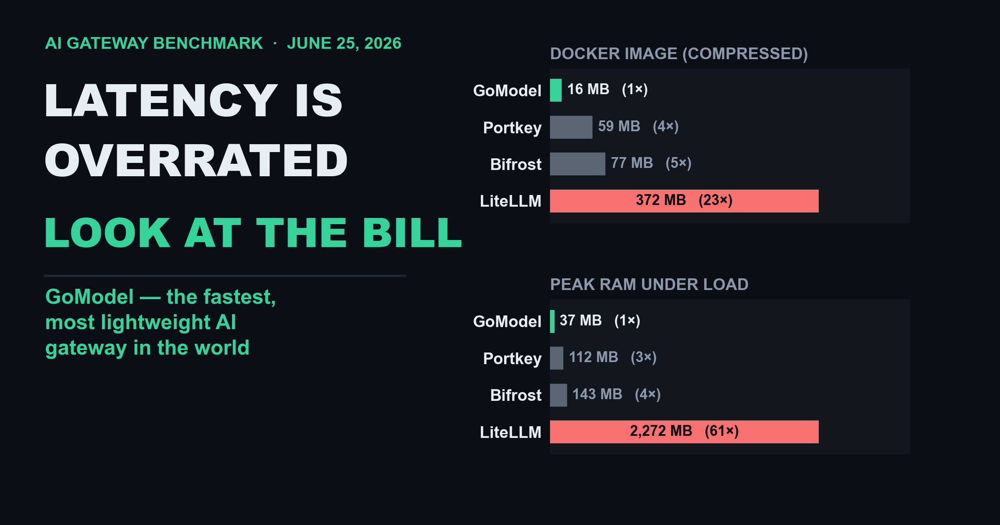
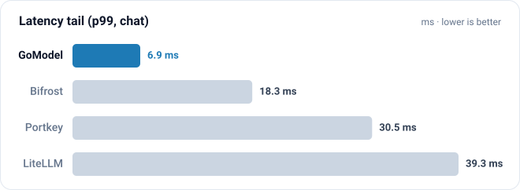
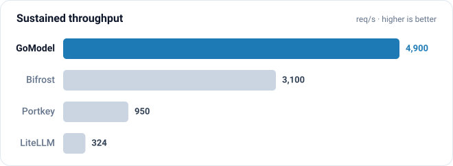
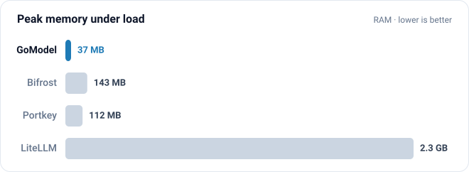
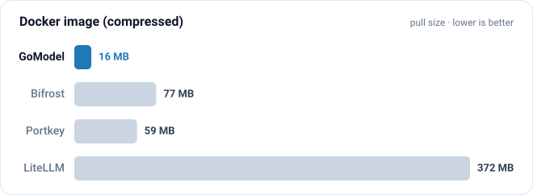

The point of this benchmark is not to prove that LiteLLM sucks. The point is to
measure GoModel honestly against the gateways people actually compare it to:
**LiteLLM, Portkey, and Bifrost**.

That said - yes, LiteLLM sucks, and that is exactly why GoModel exists. (If you're
not sure what I mean, I'd recommend giving the software a try yourself - or doing
your own research)

In October 2025 I tried to build my startup on top of LiteLLM. I quickly found
out that the software is fundamentally designed badly. A proxy-like server, on
the hot path of every request, written in Python? On top of that came a long
tail of operational issues. So I did my research and started writing GoModel: a
production-grade and enterprise-grade AI gateway / AI control plane, in Go.

The later <a href="https://futuresearch.ai/blog/litellm-pypi-supply-chain-attack/" rel="nofollow noopener noreferrer">supply-chain security incident</a> around LiteLLM only confirmed my view.
Go and its standard-library-heavy dependency trees are structurally far less
exposed to that class of attack than a sprawling Python dependency graph.

With the motivation out of the way, let's talk about what's actually worth
measuring in an AI gateway benchmark - the metrics that make a comparison
meaningful.

When I [launched GoModel on Hacker News](https://news.ycombinator.com/item?id=47861333)
I told the thread I'd publish a real, reproducible benchmark. Here it comes.

## What to measure to choose the best AI gateway

Here is the full list of metrics that matter:

- `p99` / `p95` / `p50` latency (proxy overhead)
- RAM consumption
- CPU consumption (and throughput per core)
- Cold-start time
- Docker image size
- Vendor-agnostic
- Open-source

A couple of these deserve a closer look.

### Latency

Latency matters less than you'd assume. Be precise about what we are measuring:
**proxy overhead latency** - the time the gateway itself adds, on top of the
upstream call.

The trap is treating latency as the ultimate criterion. In any real workload the
dominant latency comes from inference. The gateway's overhead is a small fraction
of the total you're already living with. A gateway that is "2x faster" at adding
`5 ms` is not meaningfully faster once a model takes `2000 ms` to respond.

So I care far more about the *tail* (p99) than the median - a gateway that is
usually fast but occasionally stalls is worse than one that is boringly
consistent.

### Resource consumption - CPU, RAM, image size, cold start

These are the metrics that actually move the needle, because they map directly to:

1. The monthly cost of your infrastructure.
2. Whether you can run the gateway serverless (AWS Lambda, GCP Functions) or on
   edge devices at all.

A `372 MB` image (`1.2 GB` unpacked) that idles at gigabytes of RAM and takes
`25 s` to cold-start is a different operational animal than a `16 MB` image that
peaks at `37 MB` of RAM and is serving traffic `0.56 s` after launch.

## The benchmark

Every gateway talked to the **same instant mock backend**, so the numbers reflect
gateway overhead, not model latency or network jitter. Each ran one at a time, in
Docker, on an **AWS `c7i.large`** (2 vCPU, 4 GiB) running the latest **Amazon Linux
2023** AMI - the whole thing is Terraform'd, runs on one command, and tears itself
down afterwards.

I actually ran this twice. The **first cut used the free-tier `t2.micro`**
(1 vCPU, 1 GiB) - cheap, self-destructing, trivial to reproduce. But I realized
that was *unfair to the competitors*: a 1 GiB box can't hold the memory-heavy
gateways (LiteLLM idles near a gigabyte), so they spill into **swap** and get
penalized for the host being too small rather than for their own overhead. So I
switched to the roomier, non-burstable **`c7i.large`** - nothing swaps there, and a
fixed-performance instance also removes the CPU-credit drift that muddies the tail
on burstable boxes. **The relative results barely moved between the two runs** -
GoModel still won on tail latency, throughput, memory, and image size. Giving the
heavy gateways enough RAM to not thrash makes the comparison *more* honest, not
less.

I tested four gateways across six workloads - chat completions, the Responses API,
and Anthropic messages, each streaming and non-streaming - driven at `8,000`
requests per workload, concurrency `10`, across **two trials with randomized
gateway order**. Latency is the **median across trials**, and I report each p99
with its min-max across trials so a single noisy window can't drive the story.

A few methodology details worth calling out:

- **Throughput is measured, not inferred.** The latency runs report
  completed-req/s at a fixed concurrency, which is just latency restated. Real
  capacity comes from a separate **concurrency sweep** that drives each gateway to
  saturation and records sustained req/s.
- **I warm up every dialect before measuring it.** LiteLLM lazily imports its
  per-dialect translation modules on first use, so a naive chat-only warmup left
  the Responses and Messages paths cold and inflated their tails. I neutralized
  that to be fair - but note what it tells you: a server that pays an import tax
  the first time it sees a request type is, again, not designed for the hot path.
- **Fair resilience config.** Every gateway runs with retries disabled. I also
  disabled GoModel's circuit breaker for the test - under the saturation sweep a
  few transient errors would otherwise trip it and it would (correctly, in
  production) start rejecting requests, which would unfairly zero out its *own*
  throughput. No other gateway here has a breaker, so off is the apples-to-apples
  setting.
- **LiteLLM at its recommended worker count.** A LiteLLM worker is effectively
  single-threaded, and its own production guidance is one worker per CPU core - so I
  run it with `num_workers` = the box's vCPU count (`2` here), the same multi-core
  access the Go gateways get for free. (Pin it to one worker and it under-uses the
  box; give it more and, as the table shows, its memory balloons. There's no setting
  that makes it both fast *and* light.)
- **Streaming uses terminal-marker or idle-gap detection**, so a gateway that
  streams content without ever sending a terminal event (Bifrost, over a
  non-native backend) is measured to last byte instead of hanging the harness.

## The comparison

Representative latency is chat completions, non-streaming. All resource figures
are measured under load on the same box.

| Metric | GoModel | Bifrost | Portkey | LiteLLM |
|---|--:|--:|--:|--:|
| Runtime | Go | Go | Node.js | Python |
| Latency overhead `p50` | **`1.8 ms`** | `2.5 ms` | `9.7 ms` | `30.6 ms` |
| Latency `p99` | **`6.9 ms`** | `18.3 ms` | `30.5 ms` | `39.3 ms` |
| Throughput (sustained) | **`4900 req/s`** | `3100 req/s` | `950 req/s` | `324 req/s` |
| Peak RAM under load | **`37 MB`** | `143 MB` | `112 MB` | `2.3 GB` |
| Efficiency (req/s per CPU %) | **`52`** | `25` | `8.2` | `2.6` |
| Cold start to first request | **`0.56 s`** | `7.1 s` | `1.1 s` | `25.5 s` |
| Docker image (compressed pull) | **`16 MB`** | `77 MB` | `59 MB` | `372 MB` |
| Workload coverage | `6/6` | `6/6` | `4/6` | `6/6` |
| Vendor-agnostic | Yes | Partial † | Yes | Yes |
| Open-source | Yes / Partial ‡ | Partial ‡ | Partial ‡ | Yes |

Same numbers, at a glance:

A few honest notes, because I'd rather you trust the rest of the table:

- **On a non-burstable host the medians are real, and GoModel leads on both ends.**
  It posts the lowest `p50` (`1.8 ms`) *and* the tightest `p99` (`6.9 ms`).
  Bifrost is a close second on the median (`2.5 ms`) - but its tail is ~`2.7x`
  heavier (`18 ms`) and it carries ~`4x` the memory under load.
- **GoModel cold-starts in `0.56 s` versus LiteLLM's ~`25 s`.** That is the
  difference between viable on a serverless platform and not.
- **Portkey** does not serve the Anthropic `/v1/messages` dialect in this
  single-provider setup, hence `4/6` (it supports Anthropic with a fuller
  virtual-key config; this is a setup limitation, not a hard capability gap).
- **LiteLLM** ships a `372 MB` compressed image (`1.16 GB` on disk), and at its
  recommended config (one worker per core) it uses **~`2.3 GB` of RAM** - two ~1 GB
  worker processes - and ~`25 s` to cold-start. Running it *properly* for multi-core throughput makes the footprint
  worse, not better. That is the cost of Python on the hot path.
- **Bifrost is not a neutral project (†).** It is built by
  [Maxim AI](https://www.getmaxim.ai/bifrost), an LLM evaluation & observability
  platform, and ships a first-party plugin that forwards your gateway traffic to
  Maxim's platform. It routes to many *model* providers, but the gateway itself is
  a channel into one vendor's ecosystem - not the independent, vendor-neutral tool
  the "1000+ models" headline implies.
- **"Open-source" deserves an asterisk (‡).** Portkey keeps its observability
  storage, dashboard, multi-team RBAC, and at-scale semantic caching in a closed
  managed tier; Bifrost's core gateway is Apache-2.0 but its Enterprise edition
  layers on closed/managed features. GoModel is open-source today, with some
  enterprise-grade features planned to stay private. LiteLLM is the most open of
  the four - its proxy core is MIT - but even it gates its enterprise features
  (SSO, audit logs, fine-grained access control) behind a separate *proprietary*
  commercial license that ships source-available in the `enterprise/` folder, not
  as free OSS.

## Summary

GoModel is the best gateway in this comparison: the lowest median *and* the
tightest latency tail, the highest sustained throughput, the best throughput per
CPU (~`52` req/s per %), the smallest compressed image (≈`23x` smaller than
LiteLLM) and memory, the fastest cold start - with full workload coverage.

I've tried to be as objective as I can, and the whole thing is built to be
**self-verifiable**: the harness provisions the AWS instance, runs every gateway
against the same backend, prints the table, and destroys the infrastructure.
**[Reproduce it yourself](https://github.com/ENTERPILOT/GoModel/tree/main/docs/2026-06-25_aws_gateway_benchmark)** -
clone the repo, point it at your AWS account, and run `./run.sh`. It builds the
images, provisions the box, runs all four gateways, prints the tables, and tears
the infrastructure back down on its own.

One caveat: it runs on **paid** AWS infrastructure, not the free tier. A
`c7i.large` is about `$0.09`/hour and the run self-destructs within an hour or
two, so budget **under `$1`** per run to be safe - and if you pass `KEEP=1` or a
teardown ever fails, you keep paying until you destroy the box, so double-check
it's gone.

If you have objections to this benchmark, reach out on the GoModel Discord (link
in the GoModel README on GitHub). And I'd genuinely like to see more impartial
gateway comparisons out there - bring your own numbers.
