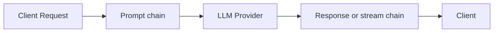

## Overview

A guardrail is a named, configured instance of a [plugin](/advanced/plugins).
Guardrails run inside every [workflow](/advanced/workflows) that references
them, in one of three phases:

- **prompt**: after routing, before the request reaches the provider
- **response**: on the complete response, before it reaches the client
- **stream**: on each streamed event (or on the buffered stream, depending on the plugin)

A guardrail can edit content, add headers, reject the request with an error,
answer it with a safe message, or let it through with a warning.

Guardrails work across all text-based endpoints:

- `/v1/chat/completions`
- `/v1/responses`
- `/v1/messages`

<Note>
  Guardrails for images, TTS, STT, and video models are planned as a separate
  system and are not covered here.
</Note>

## Quick Start

Add a `guardrails` section to your `config/config.yaml`:

```yaml
guardrails:
  enabled: true
  rules:
    - name: "safety-prompt"
      type: "system_prompt"
      order: 0
      system_prompt:
        mode: "decorator"
        content: "Always respond safely and respectfully."
```

That's it. Every request now gets the safety prompt prepended to its system instructions.

## Manage from the Dashboard

Guardrail definitions can also be created and edited from the admin
dashboard instead of `config.yaml` — useful for iterating on rules without a
redeploy, or for operators who don't manage this repo's config directly.


Open **Guardrails** in the sidebar and click **Create Guardrail**: give it a
name, pick a type (every loaded plugin with a prompt, response, or stream
hook is listed), optionally scope it to a `user_path`, and fill in the form
the plugin declares. The **Advanced** section holds the failure mode and
timeout. `config.yaml` entries are seeded into the same store at startup and
stay in sync with it, so dashboard-created and config-declared guardrails
appear side by side. The **Plugins** list at the bottom of the page shows
every loaded plugin type, its hooks, source, and health.

<Note>
  Runtime guardrail execution still depends on `GUARDRAILS_ENABLED`. With it
  off, the page still lets you manage definitions — they just don't run on
  live traffic yet.
</Note>

## How It Works


```mermaid
flowchart LR
    A[Client Request] --> B[Prompt chain]
    B --> C[LLM Provider]
    C --> D[Response or stream chain]
    D --> E[Client]
```

1. The request is mapped to a unified `Prompt` (system, user, assistant, and tool messages with stable IDs)
2. The **prompt chain** runs: each guardrail edits the prompt, or decides to block, respond, or warn
3. Edits are applied back to the original request, which continues to the provider
4. The **response chain** runs on the complete response (or the **stream chain** on the stream) before anything reaches the client

Guardrails never see the raw API request types — they operate on the unified
[`Exchange`](/advanced/plugins#the-exchange). The same guardrail works
identically for `/chat/completions`, `/responses`, and `/messages`.

## Execution Order

Each guardrail has an `order` value (the workflow step) that controls when it
runs within its phase:

- **Same order** → run **in parallel** (concurrently)
- **Different order** → run **sequentially** (ascending)

```mermaid
flowchart LR
    subgraph Order 0
        A[safety-prompt]
        B[content-policy]
    end
    subgraph Order 1
        C[compliance-check]
    end
    subgraph Order 2
        D[final-filter]
        E[audit-tag]
    end
    Order 0 --> Order 1 --> Order 2
```

Each sequential group receives the output of the previous group. Guardrails
that **edit content** (`system_prompt`, `llm_based_altering`,
`string_replace`) cannot share an order with another editing guardrail; only
one editor per order, and any number of non-editing checks (`llm_judge`,
`header_edit`) next to it. When several guardrails at one order decide
differently, the most severe decision wins: `block` > `respond` > `warn` >
`allow`.

## Configuration

### Full Structure

```yaml
guardrails:
  enabled: true    # Master switch (default: false)
  enable_for_batch_processing: false   # Also run the prompt chain on inline /v1/batches items
  rules:
    - name: "rule-name"          # Unique identifier for this instance
      type: "system_prompt"      # Plugin name
      user_path: "/team/privacy" # Optional base path for internal auxiliary calls
      phase: "prompt"            # prompt (default) | response | stream
      order: 0                   # Step within the phase
      fail_mode: "closed"        # closed (default) | open
      timeout_ms: 0              # Per-call timeout; 0 = none (default)
      config:                    # Plugin settings, validated against the plugin's schema
        mode: "decorator"
        content: "Your prompt text here."
```

`system_prompt` and `llm_based_altering` also accept their settings in a typed
block named after the type (`system_prompt:` / `llm_based_altering:`), as in
the Quick Start. The typed block and `config:` are equivalent; use `config:`
for every other type. Line-oriented keys such as `string_replace.rules` and
the `header_edit` lists accept either a block scalar (`|`) or a YAML list of
strings, joined by newlines.

### Environment Variable

You can toggle guardrails without editing the config file:

```bash
export GUARDRAILS_ENABLED=true
```

### Rule Fields

| Field | Required | Description |
| ----- | -------- | ----------- |
| `name` | Yes | Human-readable identifier. Supports spaces and unicode, but not `/`. |
| `type` | Yes | Plugin name: a built-in type below, or the manifest name of a loaded plugin. |
| `user_path` | No | Optional base user path for internal auxiliary requests. |
| `phase` | No | `prompt`, `response`, or `stream`. Default `prompt`. |
| `order` | No | Execution order within the phase. Default `0`. Same value = parallel, different = sequential. |
| `config` | No | Plugin settings. Keys, defaults, and validation come from the plugin (`GET /admin/guardrails/types`). |
| `fail_mode` | No | `closed` rejects the request with HTTP 500 when the guardrail errors or times out; `open` continues without it. Default `closed`. |
| `timeout_ms` | No | Upper bound for each call of the guardrail, enforced at the deadline. Default `0` (none). A guardrail that edits content and overruns its timeout fails the request even with `fail_mode: open`; see [Fail modes and timeouts](/advanced/plugins#fail-modes-and-timeouts). |

## Guardrail Types

Five types ship with GoModel. Each is a built-in plugin; the tables list its
config keys as they appear under `config:` and on the dashboard form.

### `system_prompt`

Adds, replaces, or decorates the system prompt on every request.

**Phases:** prompt. **Edits content:** yes.

#### Settings

| Key | Required | Default | Description |
| --- | -------- | ------- | ----------- |
| `mode` | No | `inject` | `inject`, `override`, or `decorator`. |
| `content` | Yes | | The system prompt text to apply. |

#### Modes

<Tabs>
  <Tab title="inject">
    Adds a system message **only if none exists**. Existing system prompts are left untouched.

    ```yaml
    - name: "default-system"
      type: "system_prompt"
      order: 0
      system_prompt:
        mode: "inject"
        content: "You are a helpful assistant."
    ```

    **Behavior:**
    - Request has no system prompt → adds one
    - Request already has a system prompt → no change
  </Tab>
  <Tab title="override">
    **Replaces** all existing system messages with the configured content.

    ```yaml
    - name: "strict-system"
      type: "system_prompt"
      order: 0
      system_prompt:
        mode: "override"
        content: "You are a compliance-focused assistant. Follow all company policies."
    ```

    **Behavior:**
    - Any existing system prompts are removed
    - A single new system prompt is set
  </Tab>
  <Tab title="decorator">
    **Prepends** the configured content to the existing system prompt (separated by a newline). If no system prompt exists, adds one.

    ```yaml
    - name: "safety-prefix"
      type: "system_prompt"
      order: 0
      system_prompt:
        mode: "decorator"
        content: "Always respond safely and respectfully."
    ```

    **Behavior:**
    - Existing system prompt `"You are a coding assistant."` becomes:
      ```
      Always respond safely and respectfully.
      You are a coding assistant.
      ```
    - No system prompt → creates one with just the configured content
  </Tab>
</Tabs>

### `llm_based_altering`

Rewrites the text of selected message roles by calling an auxiliary model.
In the prompt phase it rewrites the request; in the response phase it
rewrites the assistant's reply (when `roles` includes `assistant`). This is
useful for PII anonymization and other content-preserving rewrites.

The default `prompt` is derived from LiteLLM's `data_anonymization` guardrail,
so a minimal config acts as an anonymizing preprocessor.

**Phases:** prompt, response. **Edits content:** yes.

#### Settings

| Key | Required | Default | Description |
| --- | -------- | ------- | ----------- |
| `model` | Yes | | Model, alias, or `provider/model` selector for the rewrite call. |
| `provider` | No | | Optional routing hint; folded into `model` as `provider/model`. |
| `roles` | No | `["user"]` | Roles to rewrite: `system`, `user`, `assistant`, `tool`. |
| `max_tokens` | No | `4096` | `max_tokens` for the auxiliary rewrite call. |
| `skip_content_prefix` | No | | Skip rewriting when the trimmed text starts with this prefix. |
| `prompt` | No | built-in anonymization prompt | Custom rewrite instructions. |

Rewrites run through the normal translated request path in-process, so
workflow selection, failover, usage, audit, and cache behavior still apply.
The internal request uses:

- path: `/v1/chat/completions`
- user path: `{guardrail.user_path or caller user path}/guardrails/{guardrail name}`
- request origin: `plugin`

Guardrails are skipped for that internal request to avoid recursion. A rewrite
that fails keeps the original text; a cancelled or timed-out call fails the
guardrail (see `fail_mode`).

#### Example

```yaml
- name: "privacy-rewrite"
  type: "llm_based_altering"
  user_path: "/team/privacy"
  order: 1
  timeout_ms: 20000
  llm_based_altering:
    model: "gpt-4o-mini"
    roles: ["user"]
```

### `string_replace`

Replaces, flags, or blocks text that matches a list of literal or regular
expression rules. Works on prompts, responses, and streams.

**Phases:** prompt, response, stream. **Edits content:** yes.

#### Settings

| Key | Required | Default | Description |
| --- | -------- | ------- | ----------- |
| `rules` | Yes | | One rule per line as `find => replace` (the separator is ` => ` with spaces; the replacement may be empty). Blank lines and lines starting with `#` are ignored. `\n`, `\t`, and `\\` are understood on both sides in literal mode and on the replace side in regex mode. |
| `mode` | No | `literal` | `literal` matches the text as written; `regex` uses Go RE2 syntax with `$1`, `$2` capture references in the replacement (`$$` for a literal dollar sign). |
| `case_insensitive` | No | `false` | Match regardless of letter case. |
| `roles` | No | `["user"]` | Prompt messages the rules apply to: `system` (includes developer), `user`, `assistant`, `tool`. In the response phase the assistant text is always the target. |
| `on_match` | No | `replace` | `replace` substitutes; `block` rejects with an error; `respond` answers with `message` as an assistant reply; `warn` continues and records the match. Only `replace` edits the text. |
| `message` | No | `Request blocked by policy` | Error message for `block`, assistant reply for `respond`, audit note for `warn`. |
| `block_status` | No | phase default | HTTP status for `block` (400 to 599). Empty means 400 when a prompt is blocked, 502 when a response is blocked. |
| `stream_lookbehind` | No | `64` | Characters of streamed text held back so a match spanning two chunks is still rewritten; set it to at least the longest find text. Used by `replace` and `warn`. |

In the stream phase, `replace` and `warn` transform events in flight with the
configured lookbehind. `block` and `respond` buffer the whole stream so
nothing leaks before the decision, at the cost of delaying the first token
until the response is complete.

#### Example

```yaml
- name: "mask-internal-names"
  type: "string_replace"
  order: 0
  config:
    mode: "literal"
    case_insensitive: true
    rules: |
      Project Falcon => [project]
      ACME Corp => [company]
```

### `header_edit`

Sets, adds, and removes HTTP headers on the request, the client response, and
the upstream provider call. It never edits content, so it can share an order
with an editing guardrail.

**Phases:** prompt, response. **Edits content:** no.

#### Settings

Every key is a list of lines. Set and add lines look like `Name: value`;
remove lines are a bare `Name`. Blank lines and `#` comments are ignored.

| Key | Description |
| --- | ----------- |
| `request_set` | Replace a header on the live request after the prompt phase: visible to later guardrails and request logging, not forwarded to the provider. |
| `request_remove` | Drop a header from the live request after the prompt phase. |
| `response_set` | Replace a header on the response sent to the client. |
| `response_add` | Append a value to a client response header, keeping existing values. Applied once per request even when the instance runs in both phases. |
| `response_remove` | Drop a header from the client response. |
| `upstream_set` | Static headers for the provider call. Recorded but not forwarded in this release. |

Credential headers (`Authorization`, `X-Api-Key`, `Cookie`, ...) can never be
edited, and names containing `secret` or `token` cannot be set.

#### Example

```yaml
- name: "served-by"
  type: "header_edit"
  order: 0
  config:
    response_add: |
      X-Served-By: gomodel
    response_remove: |
      X-Request-Id
```

### `llm_judge`

Asks a judge model whether the prompt (or the response) violates a policy and
blocks, answers, or flags it based on the verdict. The judge must reply with
one JSON object `{"verdict":"allow"|"block","reason":"..."}`; the default
instructions do that and tell the model to ignore instructions inside the
content.

**Phases:** prompt, response, stream (buffered). **Edits content:** no.

#### Settings

| Key | Required | Default | Description |
| --- | -------- | ------- | ----------- |
| `model` | Yes | | Judge model: `provider/model`, an alias, or a virtual model. Its usage is accounted with origin `plugin`. |
| `user_path` | No | current request's path | User path the judge call is scoped to for budgets and audit. |
| `prompt` | No | built-in policy | System prompt for the judge. |
| `target` | No | `auto` | What the judge sees in the prompt phase: `auto` or `last_user` (last user message), `all_user`, `conversation`. In the response phase it always sees the assistant text. |
| `action` | No | `block` | On a block verdict: `block` rejects, `respond` answers with `respond_text`, `warn` continues and records the verdict. |
| `message` | No | `This request was blocked by policy` | Error message for `block`, audit note for `warn`. |
| `block_status` | No | phase default | HTTP status for `block` (400 to 599). |
| `respond_text` | No | `I can't help with that request.` | Assistant reply for `respond`. |
| `on_unclear` | No | `warn` | When the judge reply cannot be parsed: `allow`, `warn`, or `block` (applies `action`). |
| `max_tokens` | No | `256` | Completion cap for the judge call. |
| `temperature` | No | `0` | Sampling temperature for the judge call (0 to 2). |

Identical text is judged once per request, so an instance that runs in both
the prompt and the response phase does not double-charge for the same
content. In the stream phase the whole stream is buffered and judged as a
complete response.

#### Example

```yaml
- name: "policy-judge"
  type: "llm_judge"
  order: 5
  timeout_ms: 10000
  config:
    model: "openai/gpt-4o-mini"
    action: "respond"
    respond_text: "I can't help with that request."
```

## Examples

### Single Safety Guardrail

The simplest setup — add a safety prefix to every request:

```yaml
guardrails:
  enabled: true
  rules:
    - name: "safety"
      type: "system_prompt"
      order: 0
      system_prompt:
        mode: "decorator"
        content: "Always be safe, respectful, and helpful."
```

### Checks in Parallel with an Editor

A non-editing check shares order `0` with the system prompt editor and runs
concurrently with it:

```yaml
guardrails:
  enabled: true
  rules:
    - name: "safety-prompt"
      type: "system_prompt"
      order: 0
      system_prompt:
        mode: "decorator"
        content: "Always be safe and respectful."

    - name: "policy-judge"
      type: "llm_judge"
      order: 0
      config:
        model: "openai/gpt-4o-mini"
```

### Sequential Pipeline

Guardrails with different orders run one after another. Later groups see the output of earlier ones:

```yaml
guardrails:
  enabled: true
  rules:
    # Step 1: ensure a system prompt exists
    - name: "default-system"
      type: "system_prompt"
      order: 0
      system_prompt:
        mode: "inject"
        content: "You are a helpful assistant."

    # Step 2: decorate whatever system prompt is now present
    - name: "safety-prefix"
      type: "system_prompt"
      order: 1
      system_prompt:
        mode: "decorator"
        content: "[SAFETY] Always respond within company guidelines."

    # Step 3: anonymize user text before it reaches the main model
    - name: "privacy-rewrite"
      type: "llm_based_altering"
      order: 2
      llm_based_altering:
        model: "gpt-4o-mini"
        roles: ["user"]
```

### Response Phase: Redact Secrets on the Way Out

Runs on the complete response before it reaches the client. Set
`fail_mode: open` if you prefer an unredacted answer over a 500 when the
guardrail itself fails.

```yaml
guardrails:
  enabled: true
  rules:
    - name: "mask-keys"
      type: "string_replace"
      phase: "response"
      order: 10
      config:
        mode: "regex"
        rules: |
          sk-[A-Za-z0-9]{20,} => [redacted]
          AKIA[0-9A-Z]{16} => [redacted]
```

### Stream Phase: Redact In Flight and Judge the Whole Answer

The same instance can be referenced in several phases. `mask-keys` transforms
streamed chunks in flight (64 characters of lookbehind, so a key split across
two chunks is still caught). `answer-judge` needs the whole answer, so it
buffers the stream and the client receives it once the verdict is in.

```yaml
guardrails:
  enabled: true
  rules:
    - name: "mask-keys"
      type: "string_replace"
      phase: "stream"
      order: 10
      config:
        mode: "regex"
        rules: |
          sk-[A-Za-z0-9]{20,} => [redacted]

    - name: "answer-judge"
      type: "llm_judge"
      phase: "stream"
      order: 20
      config:
        model: "openai/gpt-4o-mini"
        action: "respond"
```

<Tip>
  A rule in `config.yaml` places one instance in one phase. To run the same
  instance in two phases, add it to the workflow twice with different
  `phase` values on the dashboard or through `POST /admin/workflows`; see
  [Workflows](/advanced/workflows#guardrail-steps).
</Tip>

## How It Works With Different Endpoints

Guardrails operate on a unified message format internally. The adaptation between API-specific request types and this format happens automatically:

| Endpoint | System prompt source | User messages source |
| --- | --- | --- |
| `/v1/chat/completions` | `messages` with `role: "system"` | `messages` array |
| `/v1/responses` | `instructions` field | `input` field |
| `/v1/messages` | `system` field | `messages` array |

<Tip>
  You don't need to think about which endpoint your users call. A single
  guardrail rule works identically for all supported text endpoints.
</Tip>

For `/v1/messages`, a request that runs any guardrail takes the translated
path (the native passthrough is skipped). A response cut by a guardrail is
reported with `finish_reason: "content_filter"` on OpenAI-compatible
endpoints and `stop_reason: "end_turn"` on `/v1/messages`.

## Decisions, Errors, and Rejection

| Outcome | What the client sees |
| --- | --- |
| **block** | An error in the endpoint's native format: HTTP 400 (prompt phase) or 502 (response and stream phases) unless the guardrail sets `block_status`; code `guardrail_blocked` unless the plugin sets its own. |
| **respond** | An ordinary assistant reply with HTTP 200 (a one-turn stream for streaming requests). |
| **warn** | The unchanged response plus an `X-GoModel-Guardrail: warn; code=<code>` header; the detail is stored in the audit trail. On a stream the header is sent only when the warn was decided before the first bytes went out (a buffered response); later warns are audit-only. |
| **guardrail failure** (`fail_mode: closed`) | HTTP 500 with code `plugin_failure`. The guardrail's name is in the logs and audit record, not in the client message. |

A blocked request never reaches the provider; a blocked response never
reaches the client. See [Plugins](/advanced/plugins#decisions) for how
decisions merge when several guardrails run at the same order.
