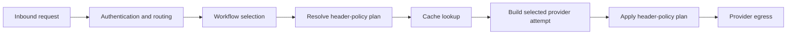

## Overview

Header policies change headers on the outbound request to an LLM provider. They are a dedicated
egress-policy stage, separate from [Guardrails](/advanced/guardrails), which operate on normalized
messages.

Use header policies to adapt existing clients without changing them. Common examples include
pinning an `Anthropic-Beta` feature, copying a tenant header into a provider-specific header, or
removing internal diagnostics before provider egress.



The resolved plan is immutable for the request. It applies to translated HTTP, passthrough,
realtime WebSocket and WebRTC provider requests, and MCP upstream HTTP requests. It does not
propagate into internal guardrail or embedding calls, and it does not carry into a different
failover provider. Retries of the selected primary provider reuse the same plan.

## Configuration

Header policies have their own top-level configuration:

```yaml
header_policies:
  enabled: true
  policies:
    - name: "pin-anthropic-beta"
      description: "Enable the long-context beta for Cline"
      step: 10
      methods: ["POST"]
      paths: ["/v1/messages", "/p/anthropic/*"]
      when:
        - header: "User-Agent"
          matches: "^cline/"
      actions:
        - action: "set"
          header: "Anthropic-Beta"
          value: "context-1m-2025-08-07"
        - action: "set"
          header: "X-Team"
          from_header: "X-Client-Team"
        - action: "remove"
          header: "X-Internal-Debug"
```

`enabled` defaults to `true`. With no policies configured, this default has no effect. Set it to
`false` as an operational kill switch without deleting policy definitions or their workflow
bindings; turning it back on resumes the existing bindings.

Every policy configured in YAML is stored as a reusable definition and attached to the managed
default workflow. `step` controls ordering: lower steps run first, and a later action can replace an
earlier action on the same header.

### Environment variables

```bash
export HEADER_POLICIES_ENABLED=true
export HEADER_POLICIES_JSON='[{"name":"remove-debug","actions":[{"action":"remove","header":"X-Internal-Debug"}]}]'
```

`HEADER_POLICIES_JSON` replaces `header_policies.policies` when set. It uses the same flattened
fields as YAML and rejects unknown fields.

## Matching and actions

| Field | Required | Description |
| --- | --- | --- |
| `name` | Yes | Unique reusable policy name. Names are shared with guardrails and cannot contain `/`. |
| `description` | No | Operator-facing description. |
| `step` | No | Ordering in the managed default workflow. Default `0`. |
| `methods` | No | HTTP methods to match. Empty matches every method. |
| `paths` | No | Public request paths. A trailing `*` matches a prefix. |
| `when` | No | Inbound-header conditions. All must match; empty means always. |
| `actions` | Yes | Outbound header mutations, applied in order. |

Each condition names a `header` and at most one predicate:

- `matches`: an RE2 regular expression
- `equals`: an exact value; `equals: ""` matches a present header with an empty value
- `present: true` or `present: false`: an explicit existence check

With no predicate, a condition means that the header must be present.

An action is `set` or `remove`. A `set` action takes exactly one of:

- `value`, including an explicit empty value
- `from_header`, which copies the first inbound value; the action is skipped if the source is absent

<Warning>
  Credential headers such as `Authorization`, `Cookie`, and `X-Api-Key`, and transport headers such
  as `Host`, `Content-Length`, and `Connection`, cannot be condition sources or action targets.
  `Accept-Encoding`, `Content-Encoding`, and `Content-Type` are also reserved because changing them
  can break decompression or body parsing. Authoring validation rejects these headers, and runtime
  enforcement provides a second boundary.
</Warning>

## Workflows

Managed definitions can be attached explicitly to an API-authored workflow:

```json
{
  "workflow_payload": {
    "schema_version": 1,
    "features": { "guardrails": false },
    "header_policies": [
      { "ref": "pin-anthropic-beta", "step": 10 }
    ]
  }
}
```

Header policies remain active when the workflow's message `guardrails` feature is false. Their
effective resolved plan, including values copied with `from_header`, participates in exact and
semantic response-cache identity.

Realtime and MCP workflow selection currently matches only `user_path` and global workflow scopes.
Provider- and model-scoped workflows do not bind to those operations, even when a realtime model is
present in the query or session body. The matched workflow's feature flags still apply to the whole
realtime or MCP request.

<Warning>
  An unscoped policy also reaches MCP upstream servers. Use `paths` such as `/v1/*` or
  `/p/anthropic/*` when a header is meaningful only to model-provider APIs, and include `/mcp*`
  only when the policy is intentionally shared with MCP egress.
</Warning>

## Dashboard and admin API

Use **Header Policies** in the dashboard to create, edit, and delete definitions. It is intentionally
separate from the Guardrails page.

The same operations are available through the admin API:

| Method | Endpoint | Description |
| --- | --- | --- |
| `GET` | `/admin/header-policies` | List definitions. |
| `PUT` | `/admin/header-policies` | Create or replace a flattened definition. |
| `DELETE` | `/admin/header-policies` | Delete by JSON body: `{ "name": "..." }`. |

A definition referenced by an active workflow cannot be deleted. A name cannot be shared by a
guardrail and a header policy.

## Audit visibility

Every policy that changes a request adds a delta to the audit entry's request-revision chain, the
same revision mechanism used by body rewriters. The dashboard audit-log drawer displays it in a
**Rewritten** tab.

- With `LOGGING_LOG_HEADERS=true`, set values are stored after header redaction. Credential-like
  names containing segments such as `auth`, `key`, `secret`, `session`, `token`, or `credential`
  are redacted. Values copied with `from_header` from such a source remain redacted even when the
  target header has an innocuous name.
- With header logging disabled, only changed header names are stored.
- Removed headers always contain names only.
- A policy that does not match records no revision.

Revisions describe the intended change at request admission; they are not proof that execution
reached provider egress.

## Migrating preview configuration

Historical configurations using `guardrails.rules[].type: header_modification` and historical
workflow references under `guardrails` remain readable. At startup, GoModel moves stored preview
definitions from the guardrail store into the dedicated `header_policy_definitions` table (or
MongoDB collection), removes the legacy rows, and keeps compiling legacy workflow references into
the egress stage. The migration is idempotent; an existing dedicated definition wins by name.

Move each definition to `header_policies.policies`, rename `order` to `step`, rename `endpoints` to
`paths`, and remove the `type` and `header_modification` wrapper. New definitions are not accepted
through `/admin/guardrails`.
