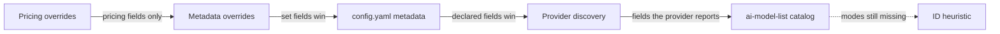

Every model in the catalog carries metadata — pricing, context window, max output
tokens, capabilities, and modes (which decide whether it shows up as a chat,
embeddings, image, or audio model). GoModel assembles it from six sources,
strongest first:



## The sources

1. **Pricing overrides** — set per model in the dashboard's **Models** page.
   The top layer for pricing fields only; unset price types keep inheriting.
   See [Cost tracking](/features/cost-tracking).
2. **Metadata overrides** — set per model in the dashboard (see
   [below](#override-metadata-from-the-dashboard)): categories, accepted input
   media, context window and max output tokens. Set fields win over everything
   below; empty fields keep inheriting.
3. **`config.yaml` metadata** — `providers.<name>.models` entries can attach
   `metadata` (`pricing`, `context_window`, `modes`, `capabilities`, …). Declared
   fields win field-by-field over everything below; omitted fields inherit. This
   is the escape hatch for local models: declaring `modes: [embedding]` also
   derives the model's category.
4. **Provider discovery** — most providers describe their models in their own
   listings, and what a provider says about its own deployment wins over the
   catalog field by field: Anthropic's display name, token limits and
   capability flags; Gemini's display name, description, token limits and
   thinking support (also on Vertex); Groq's context window, output limit,
   modalities, features and prices; xAI's context window, prices (with the
   long-context tier) and reasoning support; Fireworks' model kind, context
   window and feature flags; OpenRouter's name, description, modalities,
   supported parameters and prices; Cohere's endpoints, context length and
   features; Bedrock's display name, modalities and streaming support;
   Chutes' context length, max output, features and prices; Ollama's
   `/api/show` capabilities, family and context length; vLLM, SGLang and
   llm-d's `max_model_len`; and llama.cpp's context window and modalities
   (see [llama.cpp](/providers/llamacpp)). Capability names are mapped onto
   the catalog's vocabulary (`function_calling`, `vision`, `reasoning`, ...)
   so both layers describe one feature under one key. This matters most for
   self-hosted servers, where the running process is the only source that
   can know the real context window. Models declared via configured model
   lists skip this step.
5. **The model catalog** — the
   [`ai-model-list`](https://github.com/ENTERPILOT/ai-model-list) registry,
   fetched from `MODEL_LIST_URL` (default: the registry's `models.min.json` on
   GitHub) at startup and on every catalog refresh. It supplies the rich
   defaults — pricing, context windows, capabilities, modes — for most hosted
   models, matching IDs directly, through aliases, and with release-date
   suffixes stripped, and it fills in every field the provider above did not
   report. Input modalities count as capabilities: an entry accepting `image`
   advertises `vision` (likewise `audio_input`, `video_input`, `pdf_input`)
   unless its capabilities set that key explicitly. Wrong or missing data is best fixed by contributing to the registry;
   use an override for an immediate fix.
6. **ID heuristic** — a last-resort name check for models that end up with no
   modes at all (typical for llama.cpp and LM Studio): IDs containing `embed` or
   matching well-known embedding families (`bge`, `e5`, `gte`, `minilm`) become
   embedding models, IDs containing `rerank` become reranking models. Namespaced
   IDs are matched by their final path segment. When unsure, it claims nothing.

## Override metadata from the dashboard

When discovery or the catalog gets a model wrong — an image model from an
OpenAI-compatible provider listed under no category, a vision model whose
image input is not reported, a context window that differs on your
deployment — fix it from the **Models** page. The sliders action on a model
row opens the metadata editor:

- **Categories** decide which tabs list the model (text generation,
  embeddings, image, audio, video, utility).
- **Accepts images / audio / video / PDF** set the `vision`, `audio_input`,
  `video_input` and `pdf_input` capabilities to supported or not supported.
- **Context window** and **Max output tokens** replace the catalog's limits.

Leave a field empty (or on **Inherit**) to keep the value from the layers
below. Overrides are stored in the gateway's database, keyed by the exact
`provider/model` selector, and apply immediately — to the Models page,
`GET /v1/models`, and everything in the gateway that reads model metadata.
Other replicas pick them up within about a minute. Automate them with
`PUT /admin/model-metadata-overrides`:

```bash
curl -X PUT http://localhost:8080/admin/model-metadata-overrides \
  -H "Authorization: Bearer $GOMODEL_MASTER_KEY" \
  -H "Content-Type: application/json" \
  -d '{"selector": "pollinations/flux", "metadata": {"categories": ["image"]}}'
```

`GET` lists the overrides and `DELETE` with `{"selector": "..."}` removes one.
Prefer `config.yaml` metadata when the value belongs in version control.

## Checking where a value came from

Expand a row on the dashboard's **Models** page to see the model's effective
metadata with the layer that supplied each field, and switch the panel to
**Provider**, **Catalog**, **Config**, or **Override** to see one layer on its
own. **Accepted input** always lists images, audio, video and PDF, dimmed when
no source reports them. The same
data is served by
[`GET /admin/models/metadata`](/advanced/admin-endpoints#get-adminmodelsmetadata).

## What metadata affects

- **Pricing** drives [cost tracking](/features/cost-tracking), budgets, and
  `cost` load-balancing. Each priced field remembers its source, so the
  dashboard can show where a rate came from.
- **Modes and categories** drive dashboard grouping only — routing never
  blocks on them, so `/v1/embeddings` reaches any model
  the provider serves.
- **Context window and capabilities** are advertised on `GET /v1/models` (and
  on `GET /v1/models/{model}` for a single model) for clients that pick models
  dynamically.

## Offline behavior

If the catalog fetch fails or the deployment is air-gapped, the gateway runs
normally — only the catalog-supplied defaults (including catalog pricing) are
missing. Pricing and metadata overrides, `config.yaml` metadata, provider
discovery signals, and the ID heuristic still apply.

`MODEL_LIST_URL` accepts a local file as well as an HTTP URL:

```bash
MODEL_LIST_URL=/etc/gomodel/models.json          # bare path
MODEL_LIST_URL=file:///etc/gomodel/models.json   # file URL
```

A file is read on startup and on every cache refresh, and re-parsed only when
its content changes, so you can update pricing by replacing the file. Because
a file involves no network request, it keeps working under
`GOMODEL_OFFLINE=true`, which drops HTTP catalog URLs. Set `MODEL_LIST_URL=off`
to turn the catalog off entirely and declare metadata in `config.yaml`; see the
[production guide](/guides/production#air-gapped-and-offline-deployments) for
the full air-gap checklist.
