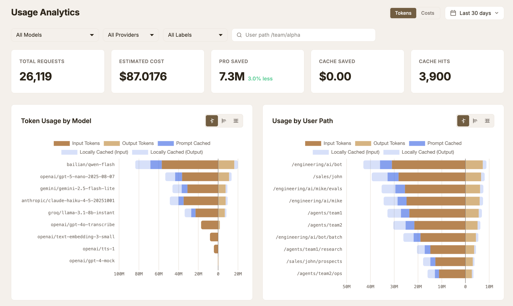
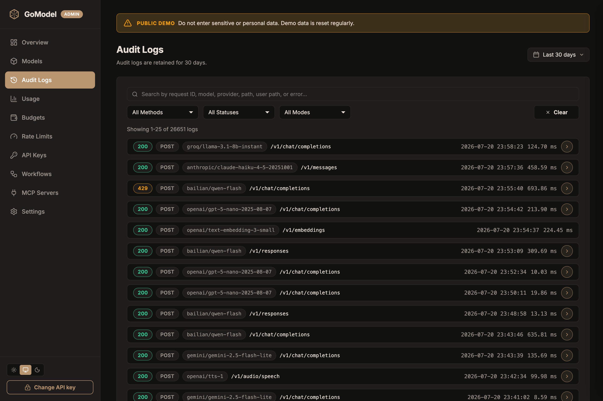

import ProviderCredentialsNote from "/snippets/provider-credentials-note.mdx";

## Run GoModel in 30 Seconds

GoModel is an OpenAI-compatible AI gateway. You can connect one endpoint and
route traffic across OpenAI, Anthropic, Gemini, DeepSeek, xAI, Groq, OpenRouter, Kilo AI,
Z.ai, Azure OpenAI, Oracle GenAI, Ollama, and more while keeping auth, audit logs, and
admin visibility in one place.

### 1. Install and start GoModel

<Tabs>
  <Tab title="macOS / Linux">
    ```bash
    curl -fsSL https://gomodel.enterpilot.io/install.sh | sh
    GOMODEL_MASTER_KEY="change-me" OPENAI_API_KEY="sk-..." gomodel
    ```

    <ProviderCredentialsNote />
  </Tab>
  <Tab title="Windows">
    ```powershell
    irm https://gomodel.enterpilot.io/install.ps1 | iex
    $env:GOMODEL_MASTER_KEY = "change-me"; $env:OPENAI_API_KEY = "sk-..."; gomodel
    ```

    <ProviderCredentialsNote />
  </Tab>
  <Tab title="Docker">
    ```bash
    docker run --rm -p 8080:8080 \
      -e LOG_FORMAT=text \
      -e GOMODEL_MASTER_KEY="change-me" \
      -e OPENAI_API_KEY="sk-..." \
      enterpilot/gomodel
    ```

    <ProviderCredentialsNote />
  </Tab>
  <Tab title="Live Demo" icon="monitor-play">
    [https://demo.enterpilot.io/admin/dashboard](https://demo.enterpilot.io/admin/dashboard?utm_source=gomodel_docs)
  </Tab>
</Tabs>

### 2. Send your first request

Use `curl` or the OpenAI SDKs for Python and JavaScript against the same
OpenAI-compatible endpoint:

<CodeGroup>

```bash curl
curl http://localhost:8080/v1/chat/completions \
  -H "Content-Type: application/json" \
  -H "Authorization: Bearer change-me" \
  -d '{
    "model": "gpt-4o-mini",
    "messages": [{"role": "user", "content": "Say hello in one sentence."}]
  }'
```

```python Python
from openai import OpenAI

client = OpenAI(
    base_url="http://localhost:8080/v1",
    api_key="change-me",
)

completion = client.chat.completions.create(
    model="gpt-4o-mini",
    messages=[{"role": "user", "content": "Say hello in one sentence."}],
)

print(completion.choices[0].message.content)
```

```javascript JavaScript
import OpenAI from "openai";

const client = new OpenAI({
  baseURL: "http://localhost:8080/v1",
  apiKey: "change-me",
});

const completion = await client.chat.completions.create({
  model: "gpt-4o-mini",
  messages: [{ role: "user", content: "Say hello in one sentence." }],
});

console.log(completion.choices[0].message.content);
```

</CodeGroup>

### 3. Open the Admin Panel

Open this URL in your browser:

`http://localhost:8080/admin/dashboard`

<Tip>
  Dashboard UI is enabled by default (`ADMIN_UI_ENABLED=true`). Admin API
  endpoints are at `/admin/*` and use the same bearer auth as the main
  API.
</Tip>

## Verify Models

List currently available models:

```bash
curl -s http://localhost:8080/v1/models \
  -H "Authorization: Bearer change-me"
```

Use one of those model IDs in your requests.

## Admin Panel Preview

### Usage Analytics



### Audit Logs



## Next Steps

- Update, pin a version, or uninstall: [FAQ](/about/faq)
- Understand response caching: [Cache](/features/cache)
- Add spend limits: [Budgets](/features/budgets)
- Configure production settings: [Configuration](/advanced/configuration)
- Add request policies: [Guardrails](/advanced/guardrails)
- Connect OpenClaw: [Using GoModel with OpenClaw](/guides/openclaw)
